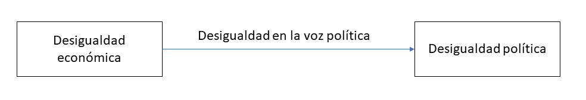

class: inverse, bottom, right


```{r, include=FALSE,echo=FALSE,results='hide'}
#install.packages("pagedown")
#library(pagedown)
#pagedown::chrome_print("Presentacion.html")

#remotes::install_github("jhelvy/xaringanBuilder")
#remotes::install_github('rstudio/chromote')


#library(xaringanBuilder)

#build_pdf("Presentacion.html")
          
#xaringan :: inf_mr ()
#xaringan::summon_remark()
```


```{r setup, include=FALSE, cache = FALSE}
require("knitr")
options(htmltools.dir.version = FALSE)
pacman::p_load(RefManageR)
```

```{r eval=FALSE, echo=FALSE}
# Correr esta linea para ejecutar
rmarkdown::render('xaringan::moon_reader')
```

<!---
About macros.js: permite escalar las imágenes como [:scale 50%](path to image), hay si que grabar ese archivo js en el directorio.
.pull-left[<images/Conocimiento cívico.png>] 
.pull-right[<images/Conocimiento cívico_graf.png>]

--->

# __¿La desigualdad corroe la participación democrática?:__
## Metaanálisis del Efecto de la desigualdad socioeconómica en la desigualdad política.
<br>
<hr>


### Francisco Meneses Rivas, *Universidad de Chile*

<br>

.small[]

???
 
Esto busca reforzar lo que es una base para la propuesta de mi tesis 

---

layout: true
class: animated, fadeIn


---
class: inverse, middle, center, slideInRight

# Breve reflexión sobre metanalisis en sociologia

???
me costo elegir un tema dado que la sociologia es menos sistematica en la forma de medir algo o de evaluar causalidad.

---
class: inverse, middle, center, slideInRight

# Plantiento del problmea
---
## Variables y relaciones (Cooper, 2017)

 .pull-left[<br>__Desigualdad política__: Desigual probabilidad de participación y/o de ser escuchado, según nivel socioecnomico]

.pull-left[__Desigualdad economica__: 
desigual poseción de bienes que influye en las vivencias estratificadas de las personas.]

.center[__Desigualdad en la voz politica__: <br> Refiere al efecto de la desigualdad socail en la desigualdad politica]


.center[]
 
???

Aqui, según cooper señala necesario, se especifican claramente las variable y las relaciones.


---

## Objetivos de investigación
 
 
__Objetivo general:__ <br> Identificar la existencia o la inexistencia de un efecto negativo de la desigualdad social en la igualdad politica. 


 
* Se reguistro la hipótesis general y una hipotesis de moderación en la plataforma OSF: [Pre-registration](https://osf.io/tkhea)

.pull-right[

        
]

???
¿Sera problema centrarme en estudios basados en la misma encuesta? la iccss que tiene artas olas en varios paises 

 

---
# Posibles moderadores: Explicando las diferencias entre estudios

A modo general, se hipotetíza que la fuerza del efecto sera mayor cuando se tenga una mayor muestra de paieses, pues se tendra una muestra mas representativa de la desigualdad mundial. 

 * Cantidad de países en el estudio

 
???
Quizas seria interesante controlarlo directamente por desigualdad en la educación, pero no se como operacionalizar algo asi.
---
class: inverse, middle, center, slideInRight

# Diseño y planificación de busqueda
---

# Codigo de busqueda

.pull-left[
__Tesauro de referencia__

* [ELSST Thesaurus](https://elsst.cessda.eu/id/2005dd1d-819c-4329-93cd-b67baad666a1) 

* Plataforma de bÚsqueda WOS

]


.pull-right[
        
]

.small[
.center[
__operador booleano__ 

> AB=("political inequality") OR AB=("political gap")  OR AB=("political participation")  OR AB=("PARTICIPATION IN POLITICS")  OR AB=( "POLITICAL CAMPAIGNS" ) OR AB=( "POLITICAL CAMPAIGNS" ) OR AB=("POLITICAL PROTEST")  OR AB=("VOTING") )  AND ( AB=(Inequality) OR AB=(GINI) OR   AB="Social Inequality" OR   AB="Social equality") AND (ALL=("countries") OR  ALL=("country") OR ALL="states")  NOT (AB=("gender") OR AB=("women")  OR  AB=("Young") OR AB=("race"))

]
]

---

# Criterios de clasificación:

*	Criterios
  +	Utiliza inferencia
  +	Tiene país como unidad
  +	Tiene las variables dependiente e independiente
  +	 Tiene los controles adecuados. 


???

¿Cúal otro podría ser bueno? lo necesito por que tengo muchos resultados

---

# Cantidad y cualificación de los codificadores.

*  Actualmente solo se cuenta con un codificador, el cual posee master en Ciencias Sociales

*  En una segunda etapa de este estudio se incluirá codificadores, que serás estudiantes de los últimos años de sociología.

  + Para facilitar la codificación y la consolidación de los datos se ha generado un protocolo de codigicación que esta disponible en formato encuesta online en google forms. 
  
  + [Protocolo de codificación Form](https://docs.google.com/forms/d/e/1FAIpQLSe4IEgts63hDZ7H5t6zTb8aKxXyg_vlWcJB3nGks9KBPuXZAQ/viewform?usp=sf_link)
  
  + Evaluación de consistencia 
---


# Cantidad de documentos encontrados

*  Para ordenar la selección de los documentos se utilizo la plataforma Zotero y se genero una biblioteca publica: [Metanalisis desigualdad politico-economica](https://www.zotero.org/groups/4470212/inequalitysocialpolitical/library)


---
class: slideInRight, middle, inverse

***
# __Metodología__: Metodo de sintesis...
***

---

# Metodo de sintesis:

* Alternativas [Se aplicaran en el futuro]

  + Peterson y Brown
  + Philip, Huy, In-Sue e Inddekinge, 2017
  
* Método aplicado 
  
  + [Richardson et al. 2020](https://link.springer.com/article/10.1007/s00411-020-00863-w)
  + [Paquete Metaan](https://github.com/Package-Metaan-Rep/Metaan)


---

# Resultados 

### Aproximación descriptiva


---

# Resultados 

```{r, echo=FALSE}

library(Metaan)

study <- c("Somma & Bargsted (2018)", "Cole (2018) A", "Cole (2018) B", "Houle. (2018) A","Houle. (2018) B","Houle. (2018) C")

beta<- c(0.101, -0.023, -0.032, -0.167,-0.0537, -0.0391)
lower_ci <- c(0.289, -0.016, -0.025, -0.1822,   -0.06305, -0.04347)
  upper_ci <- c(-0.087, -0.030,-0.039,-0.1518, -0.04435,-0.0347)

donne <- data.frame(cbind(study, beta, lower_ci, upper_ci))

donne$beta <- as.numeric(as.character(donne$beta))
donne$upper_ci <- as.numeric(as.character(donne$upper_ci))
donne$lower_ci <- as.numeric(as.character(donne$lower_ci))


estmeta(Beta=donne$beta, u=donne$upper_ci, l=donne$lower_ci, test="FIXED")
```

---   

# Conclusiones y discuciones

* Se evaluo distintos articulos para comprobar si la desigualdad economica corroe la igualdad politica

* Los resultados actuales apuntan en la dirección esperada, de modo tal que se puede afirmar la existencia de un efecto negativo.

* No obstante el efecto es más bien pequeño, por lo que es necesario comprender que puede moderar este efecto. 

---

# Limitaciones:

* Faltan estudios

* Hacer modelo anidado para los mismos estudios

* Incluir calculo de tamaño de efecto

* Inlcuir co-codificadores. 

* Preparar pauta de codificación y protocolo en google forms.


