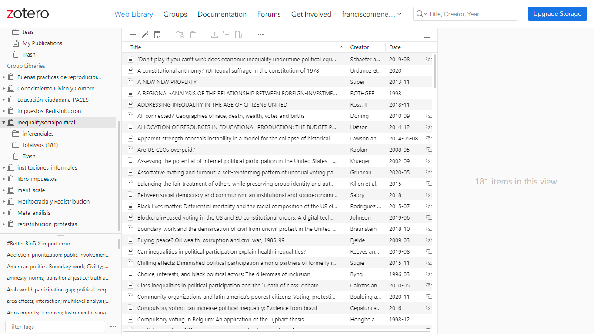

class: inverse, bottom, right


```{r, include=FALSE,echo=FALSE,results='hide'}
#install.packages("pagedown")
#library(pagedown)
pagedown::chrome_print("Presentacion.html")

remotes::install_github("jhelvy/xaringanBuilder")
remotes::install_github('rstudio/chromote')


library(xaringanBuilder)

build_pdf("Presentacion.html")
          
#xaringan :: inf_mr ()
#xaringan::summon_remark()
```


```{r setup, include=FALSE, cache = FALSE}
require("knitr")
options(htmltools.dir.version = FALSE)
pacman::p_load(RefManageR)
```

```{r eval=FALSE, echo=FALSE}
# Correr esta linea para ejecutar
rmarkdown::render('xaringan::moon_reader')
```

<!---
About macros.js: permite escalar las imágenes como [:scale 50%](path to image), hay si que grabar ese archivo js en el directorio.
.pull-left[<images/Conocimiento cívico.png>] 
.pull-right[<images/Conocimiento cívico_graf.png>]

--->

# __Estimando la desigualdad en educación cívica:__
# El efecto los recursos culturales de la familia en las habilidades para la ciudadania
## *Metanálisis en torno al Estudio internacional de educación cívica y ciudadana ICCS *
<br>
<hr>


### Francisco Meneses Rivas, *Universidad de Chile*

<br>

.small[]

???
 
Esto busca reforzar lo que es una base para la propuesta de mi tesis 

---

layout: true
class: animated, fadeIn


---
class: inverse, middle, center, slideInRight

# Breve reflexión sobre metanalisis en sociologia

???
me costo elegir un tema dado que la sociologia es menos sistematica en la forma de medir algo o de evaluar causalidad.

---
class: inverse, middle, center, slideInRight

# Plantiento del problmea
---
## Variables y relaciones (Cooper, 2017)

 .pull-left[<br>__Conocimiento cívico__: el conocimiento de principios democráticos así como las habilidades para aplicar estos conocimientos en la vida ciudadana.]

.pull-left[__Recursos culturales__: 
recursos materiales y cognitivos asociados a un alto nivel educativo, tales como el gusto y la tenencia de libros o la poseción de titulos universitarios]

.center[__Reproducción intergeneracional__: <br>refiere a la continua reproducción de la desigualdad politica desde una generación a otra, mediante la socializaicón familiar]


.center[]
 
???

Aqui, según cooper señala necesario, se especifican claramente las variable y las relaciones.


---

.center[]
---

## Objetivos de investigación
 
 
__Objetivo general:__ <br> Identificar cual es el tamaño de efecto integrado sobre la relación entre recursos familiares y las habilidades para la vida cívica y ciudadana
 


.pull-right[

        
]

???
¿Sera problema centrarme en estudios basados en la misma encuesta? la iccss que tiene artas olas en varios paises 

 

---
# Posibles moderadores: Explicando las diferencias entre estudios

A modo general, se hipotetíza que la fuerza del efecto puede variar entre países dependiendo del nivel de desigualdad que exista en educación. 

 * __Indice GINI__
 
 * __%PIB Invertido en educación__
 
También se propone que el efecto dependerá de la calidad de la medición. 
 
???
Quizas seria interesante controlarlo directamente por desigualdad en la educación, pero no se como operacionalizar algo asi.
---
class: inverse, middle, center, slideInRight

# Diseño y planificación de busqueda
---

# Codigo de busqueda

.pull-left[
__Tesauros de referencia__

* [UNESCO Thesaurus](http://vocabularies.unesco.org/browser/thesaurus/en/) 
* [CESSDA Thesauri](https://thesauri.cessda.eu/en/)
* [ERIC thesaurus](https://eric.ed.gov/)

]

.pull-right[
        
]


.center[
__operador booleano__ 

("Civic Knowledge" [OR]() "Civic Education" [OR]() "Political education" [OR]() "Political skills") 
[AND]()

( "Social class"[OR]() "Cultural capital" [OR]() "Educational levels" [OR]() "Cultural resources" [AND]()


(gap [OR]() Breach [OR]() Inequality)

]


???

Quizas es un codigo muy escueto, me gustaria discutirlo

como justifico sacar o menter uno si no esta en un tesauro


¿Como puedo incorporar un termino de un tesauro con muchos sinónimos en otros idiomas? [Tesauro-civic-education](https://thesauri.cessda.eu/elsst/en/page/?uri=https%3A%2F%2Felsst.cessda.eu%2Fid%2F974dcf69-b332-4a20-a092-af54125168ba)

---
(ALL=("civic knowledge") OR ALL=("Civic Education") OR ALL=("political education")) AND (ALL=("Social class") OR ALL=("Cultural capital") OR ALL=("Educational levels") OR ALL=("Cultural resources")) AND (ALL=(Inequality) OR ALL=(gap))

---

# Criterios de clasificación:

* empirico y métodos cuantitativos

* Utiliza conocimiento cívico como dependiente

* Utiliza recursos como independiente o control

* ~~Utiliza el estudio ICCS~~

* Utiliza ICCS

???

¿Cúal otro podria ser bueno? lo necesito por que tengo muchos resultados

---


# Busqueda en wos

*  Primera búsqueda 



???

¿Hay alguna forma de automatizar la selección? no quiero leer tanto...

se me ocurre meter a e y seleccionar si tiene determinada palabra en el resumen

---