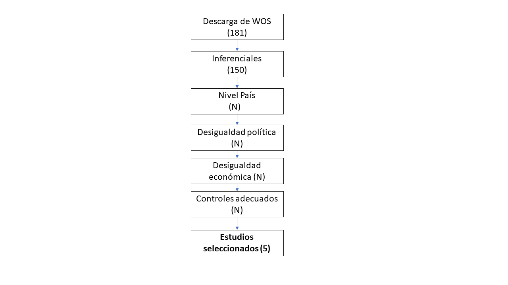

# Introducción

Desde la sociología se ha señalado recurrentemente que la creciente desigualdad social es una amenaza a la mantención y a la calidad de la democracia  (). No obstante, no hay  un consenso respecto a la veracidad de esta amenaza [], existiendo estudios que señalan este efecto más bien como irrelevante. Resulta fundamental avanzar hacia una idea unificada del perjuicio real que produce la desigualdad en la democracia, puesto que la opinión científica posee un rol importante en la discusión pública, en la cual la desigualdad y sus consecuencias son un tema contingente. Esta es una problemática relevante ya que afecta el derecho a participar de las personas y fomenta estados poco representativos.

Stockemer, D. (2016) mediante una revisión sistemática llega a la conclusión de que el efecto de la desigualdad dé la proporción de participación no es claro. No obstante, no ve el efecto de la desigualdad en la participación.

Actualmente múltiples trabajos abordan los efectos de la desigualdad en la participación aludiendo a la teoría de recursos. Según esta perspectiva las personas de menores recursos económicos, académicos y de tiempo tienden a tener una menor participación política que personas con estudios y mejor condición económica [].  Desde esta perspectiva se ha evidenciado como la posición social del sujeto influye en sus posibilidades de participación política. Este efecto de los recursos ha sido estudiado en distintos contextos y se ha evidenciado que es más fuerte en sociedades desiguales. En esta línea, muchos estudios demuestran la desigualdad económica agregada de un país influencia en su desigualdad política. Este cambio de enfoque hacia la política comparada puede ser de gran ayuda para comprender el efecto de la desigualdad en la democracia. Anteriores síntesis de investigaciones con discusiones teóricas han destacado la importancia de la desigualdad en la democracia [], aunque hasta ahora no se ha hecho un estudio sistemático al respecto. Por ello, el objetivo de este documento es dar cuenta de un valor más aproximado al real efecto que genera la desigualad económica en la desigualdad política. 

En este trabajo se realiza un metaanálisis de los estudios que investigan el efecto, a nivel país, de la desigualdad económica sobre la desigualdad de la participación. Se utilizará solo trabajos que estudien esta relación desde una perspectiva multivariada, controlando por variables relevantes como el nivel de riqueza. Esto es necesario para evitar confundir el efecto de la desigualdad con el efecto de otras variables macroeconómicas. Así se seleccionarán estudios a nivel país que tengan como dependiente la desigualdad política, la desigualdad económica como independiente y que estén controlados por la riqueza del país. De estos estudios se registrarán los tamaños de efectos, las características de la muestra de países y controles adicionales que utilizarán. 

Se espera que la fuerza de intensidad del efecto de la desigualdad sobre la desigualdad política se vea moderado por la cantidad del número de países y por la inclusión controles de la calidad de la democracia. Se hipotetiza que mientras mayor cantidad de países se incluya mayor será su diversidad, lo cual permitirá una muestra más representativa de las desiguales internacionales. 
[Características psicométricas de las medidas: podría]

[ Método (s) de síntesis y, si se utilizó el metanálisis, los métodos específicos utilizados para integrar los estudios (p. Ej., Tamaño del efecto]

El presente metaanálisis busca medir el efecto de la desigualdad económica sobre la desigualdad  política en la consolidación de un beta estandarizado general y su respectivo intervalo de confianza. En metaanálisis es complejo el trabajo con regresiones y parámetros beta, existiendo múltiples opciones al respecto []. En esta ocasión, para calcular un efecto agregado, se utilizó una técnica de ponderación de los betas estandarizados, la cual considera los intervalos de confianza y con ello la potencia de cada estudio. El resultado de este proceso es un beta estandarizado con su respectivo intervalo de confianza, lo cual permite saber la significancia del efecto.  Este calculo es realizado con ayuda del paquete Metaan. 

En una versión futura, será necesario incorporar una medida agregada del tamaño del efecto. Sería positivo hacer dicho calculo incorporando distintas propuestas sobre como calcular el mismo, siguiendo los métodos de tal y tal. 

En la versión actual de este metaanálisis no se cuenta con un protocolo para la selección y codificación de los estudios. No obstante, se empezó a diseñar un protocolo aplicable a múltiples codificadores.  	Se puede acceder a una primera versión de este protocolo mediante el siguiente enlace. El protocolo se ha generado en el formato de encuesta online, para facilitar el trabajo de la codificación y la consolidación de los datos producidos por los diferentes codificadores. Para ello, se utilizo la plataforma de Qualtrics.

# Metodo

## Estrategia de busqueda:

El objetivo de la búsqueda fue localizar investigaciones que cumpliesen con el siguiente conjunto de criterios para ser seleccionada: 1) Trabajos inferenciales, 2) que utilicen países como unidad de análisis, 3) que posean desigualdad política como dependiente, 3) desigualdad económica como independiente y 4) controlen por el nivel de riqueza del país.  

Para localizar textos con estas condiciones se utilizo la plataforma Web of Science. Se genero un código de búsqueda con los términos relevantes, basado en los estudios conocidos sobre el tema. Estos términos de búsqueda fueron enriquecidos por la revisión del tesauro ELSST, del cual se rescató la importancia de agregar antónimos, hipónimos e hiperónimos de los términos.  A continuación, se expone el código y los conectores booleanos utilizados para la búsqueda en la plataforma WOS.

> AB=("political inequality") OR AB=("political gap")  OR AB=("political participation")  OR AB=("PARTICIPATION IN POLITICS")  OR AB=( "POLITICAL CAMPAIGNS" ) OR AB=( "POLITICAL CAMPAIGNS" ) OR AB=("POLITICAL PROTEST")  OR AB=("VOTING") )  AND ( AB=(Inequality) OR AB=(GINI) OR   AB="Social Inequality" OR   AB="Social equality") AND (ALL=("countries") OR  ALL=("country") OR ALL="states")  NOT (AB=("gender") OR AB=("women")  OR  AB=("Young") OR AB=("race"))

El Código expuesto tiene tres funciones, primero identificar distintos términos utilizados para hablar de desigualdad política y desigualdad en prácticas políticas . En segundo lugar, identifica distintos conceptos asociados a la desigualdad económica. En tercer y último lugar, intenta excluir estudios que refieren a desigualdades políticas que no son desigualdades económicas propiamente, como la desigualdad de genero o de grupos etarios. 

Enlace la búsqueda en el tesaur: [Desigualdad política](https://elsst.cessda.eu/id/2005dd1d-819c-4329-93cd-b67baad666a1)

## Proceso de selección

Como se expone en el siguiente diagrama se obtuvieron 181 artículos mediante el Código de búsqueda. De esos documentos 150 tienen pruebas de inferencia, NN son a nivel país, NN poseen la variable desigualdad política como dependiente, NN incluían la desigualdad económica como independiente y NN tenían los controles adecuados. Hasta ahora, hay 5 estudios seleccionados para el metaanálisis.  Esta revisión de literatura se realizó en Octubre del 2021.



El proceso de selección de los textos se realizo de modo secuencial aplicando los distintos criterios. En principio, para evaluar si existen pruebas inferenciales se evaluó el texto completo en búsqueda de tablas con pruebas estadísticas, o pruebas estadísticas descritas en el texto. Luego, se reviso en dichas tablas o e metodología cual era el N y cual era la unidad de medida, esperando que fuesen países o países-año. 

En esta oportunidad no se completo el proceso de selección, aunque se logro identificar 5 textos útiles que cumplen con todas las condiciones. Será necesario realizar el proceso completo, incluyendo a codificadores en las distintas etapas del trabajo. 

## Proceso de codificación 

Actualmente el proceso de codificación incluyo simplemente el registro de los valores necesarios para utilizar el paquete Metaan. Estos corresponden al beta estandarizado de cada estudio y a su respectivo intervalo de confianza. En esta oportunidad la codificación se realizo por un codificador único. Este codificador posee el grado de licenciado en Sociología y es postulante a Master en ciencias sociales. 

HACER PAUTA DE CODIFICACIÓN QUALTRICS.

## Método de síntesis.


Trabajar en metanalisis con resultados provenientes de regresiones es aun un tema complejo y en discusión, en lo que respecta a los métodos de síntesis.  Una de las alternativas que cuenta con mayor respaldo actualmente es la de Peterson y Brown, no obstante, existen críticas a la herramienta propuesta por estos autores  (Philip, Huy, In-Sue e Inddekinge, 2017; Philip, 2018). Las críticas al método tradicional también vienen acompañadas de propuestas, no obstante, ni estas nuevas propuestas ni la forma tradicional entregan herramientas claras y de acceso gratuito para realizar los cálculos que proponen. Por contraparte, la propuesta de [Richardson et al. 2020](https://link.springer.com/article/10.1007/s00411-020-00863-w), posee una herramienta de libre acceso que facilita los cálculos, el paquete de R Metaan. Por esta razón practica se ha decidido trabajar con la propuesta de Richardson para el calculo de un efecto integrado. 


Para la realización de este método integrado, como se mencionó, se trabajo con el software de análisis  R en su versión 4.1.1, mediante la interfaz Rstudio. Se trabajo con el paquete Metaan, el cual posee cálculos de efectos agregados basados en la propuesta de Richardson et al. 2020. En particular se utilizo la función estmeta(), probando con efectos fijos y aleatorios. 
Metaan
Descripción del trabajo con metaan Utiliza métodos estadísticos de cálculo de metanálisis como el modelo de efectos fijos y el modelo de efectos aleatorios

# Resultados 

Como se menciono pese al trabajo realizado solo se ha logrado localizar 3 artículos que abordan la relación esperada. De ellos, dos de esos artículos entregan más de un cálculo, pues ofrecen distintas operacionalizaciones ya sea para la variable dependiente o independiente. Un articulo entrega dos valores beta, mientras otro entrega tres.	
A continuación, se expone un grafico donde se compara el efecto de las distintas estimaciones, medido en beta estandarizado, con sus respectivos intervalos de confianza. Además, para facilitar la interpretación se ha agregado una línea roja en el 0 que representa un efecto nulo. Como se puede ver en el gráfico, todos los estudios a excepción del de Somma y Bargsted encuentran un efecto significativo, que, además, es negativo. 


```{r, echo=FALSE}
library(Metaan)

study <- c("Somma & Bargsted (2018)", "Cole (2018) A", "Cole (2018) B", "Houle. (2018) A","Houle. (2018) B","Houle. (2018) C")

beta<- c(0.101, -0.023, -0.032, -0.167,-0.0537, -0.0391)
lower_ci <- c(0.289, -0.016, -0.025, -0.1822,   -0.06305, -0.04347)
  upper_ci <- c(-0.087, -0.030,-0.039,-0.1518, -0.04435,-0.0347)

donne <- data.frame(cbind(study, beta, lower_ci, upper_ci))

donne$beta <- as.numeric(as.character(donne$beta))
donne$upper_ci <- as.numeric(as.character(donne$upper_ci))
donne$lower_ci <- as.numeric(as.character(donne$lower_ci))


estmeta(Beta=donne$beta, u=donne$upper_ci, l=donne$lower_ci, test="FIXED")

```

El modelo fijo indica un valor beta único de -0.04 con SE igual a 0. Es probable que este resultado sea producto de la escasa cantidad de artículos analisádos.  


```{r}
estmeta(Beta=donne$beta, u=donne$upper_ci, l=donne$lower_ci, test="RANDOM")
```

Por su parte la estiamción de modelo aleatorio indica un beta agregado de -0.06 con un SE DE 0.01. Este valor puede ser considerado como significativo ya que el intervalo de confianza no pasa por el 0. 

Cabe destacar que este es un efecto más bien pequeño. Por ello, resulta interesante evaluar que es aquello que determina la fuerza del efecto de la desigualdad. Este es un aspecto en el cual se debe profundizar.  


# Conclusión 

## Sintesis

## Limitaciones 

* Faltan estudios

* Hacer modelo anidado para los mismos estudios

* Incluir calculo de tamaño de efecto

* Inlcuir co-codificadores. 

* Preparar pauta de codificación y protocolo en google forms.


